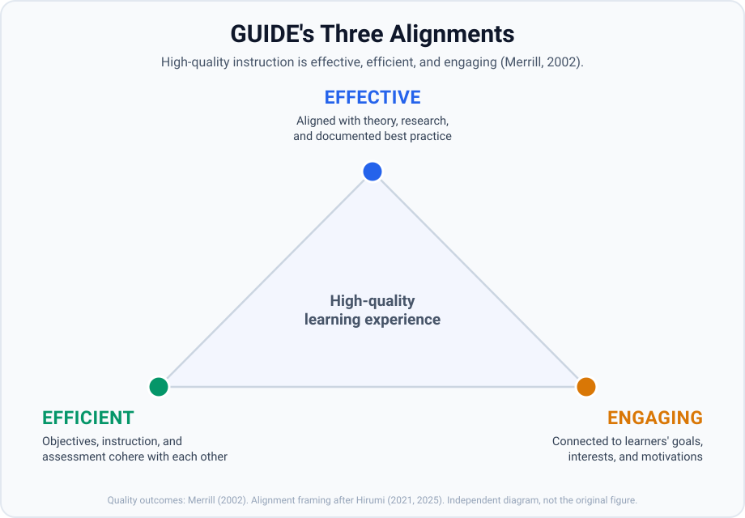

# GUIDE - Grounded Universal Instructional Design Evaluator

**Design and grade instruction. Learning science, made executable.**

**Version 3.4.0** | Apache License 2.0

GUIDE is a learning-science framework with two modes: **author** instructional content against 60 theory-grounded dimensions, or **evaluate** existing content against the same dimensions. The rubric that grades a finished course is the spec you design the next one from - one set of criteria, run forward to generate or backward to judge. It was developed as a capstone synthesis of my experience in the University of Central Florida Master of Arts in Instructional Systems program.

The framework spans **10 archetypes** and **60 dimensions**, each grounded in named theoretical sources and scored on a 1-5 scale with concrete behavioral anchors.

Because the dimensions are specific enough to score against, they're specific enough to build against.

## How It Works

GUIDE is built on the LLM-as-a-judge pattern (Zheng et al., 2023). Each archetype is a standalone judge prompt - the full rubric for one slice of instructional quality - that loads into any LLM capable of following structured evaluation instructions. Those same rubrics drive both modes:

- **Evaluate mode** - the judge reads existing instructional content, scores it against 6 theory-grounded dimensions, and returns a structured scorecard with cited rationale a designer can act on. Nothing is scored on vibes.
- **Design mode** - the same dimensions become forward-looking authoring criteria. Content is written *against* the anchors instead of graded after the fact, so a single run can produce a complete artifact - for example a 90-minute hands-on workshop with facilitator guide, slide deck, and one-page job aid - that already satisfies the rubric it would be judged by.

Because both modes share one rubric, content authored in design mode and content checked in evaluate mode are held to exactly the same bar.

## Quality Outcomes: Effective, Efficient, Engaging

High-quality instruction is effective, efficient, and engaging (Merrill, 2002). Hirumi (2025), building on Hirumi, Ratliff & de la Mora (2021), maps each of those quality outcomes to an alignment of instructional elements. GUIDE operationalizes each:

<p align="center">
  
</p>

- **Effective** - instructional elements aligned with **theory, research, and documented best practice** (Hannafin, Hannafin, Land, & Oliver, 1997). Whether the artifact reflects what learning science actually says works. This is the *grounded* in Grounded Universal Instructional Design Evaluator.
- **Efficient** - **objectives, instructional strategies (chunking and sequencing), and learner assessments aligned with each other** (Tyler, 1949; Bloom, 1956; Dick, Carey & Carey, 2015). Whether the artifact's internal pieces cohere so learners aren't doing wasted work.
- **Engaging** - instructional elements aligned with **learners' personal and professional goals, interests, and motivations** (Keller, 1987, 2010 - ARCS). Whether the artifact connects to who the learner is and what they're trying to become.

Each archetype below evaluates one or more of these alignments. The "Primary alignment" column tags the alignment(s) the archetype primarily produces evidence about.

## The Ten Archetypes

Each archetype maps to a phase of the ADDIE instructional design lifecycle:

| Archetype | Focus | ADDIE Phase | Primary alignment |
|-----------|-------|-------------|-------------------|
| Needs Analysis | Rossett, Kaufman, Gilbert, Keller (ARCS) | Analyze | Efficient (objectives) + Engaging (L4 ARCS) |
| Instructional Sequencing | Gagne, Reigeluth, van Merrienboer, Keller (ARCS) | Design | Efficient (Obj↔Strategy) + Effective (theory) |
| Story Design | Campbell, Vogler, Harmon, Snyder | Design | Engaging (narrative/emotional) |
| Cognitive Neuroscience | Kandel, Sousa, Medina, Ausubel, Brown | Design | Effective (theory) + Engaging (relevance) |
| Multimedia Design | Mayer, Paivio, Sweller | Develop | Effective (Mayer/Sweller) |
| Accessibility & Technical | WCAG, CAST UDL, Section 508 | Develop | Cross-cutting (precondition for all three) |
| Adult Learning Communication | Knowles, Mezirow, Sweller, Ausubel | Implement | Engaging (problem-centered, personalized) |
| Assessment Design | Bloom, Webb, Messick | Evaluate | Efficient (Obj↔Assessment) |
| Formative Evaluation | Scriven, Kirkpatrick, Stufflebeam | Evaluate | Cross-cutting (measures whether alignment was achieved) |
| Curriculum Alignment | Tyler, Bloom/Anderson & Krathwohl, Webb (DoK), Mager, Dick & Carey, Wiggins & McTighe, Reigeluth, Hirumi | Cross-ADDIE | **Efficient** (synthesis archetype - Obj↔Strategy↔Assessment + vertical + discipline) |

## Repository Structure

```
GUIDE/
├── README.md                              # This file
├── LICENSE                                # Apache License 2.0
├── NOTICE                                 # Copyright and attribution
├── .claude-plugin/marketplace.json        # Plugin marketplace manifest (points at skill/guide-instructional-design-plugin/)
├── GUIDE_Rubric_Document.docx             # Printable rubric document (v3.4.0, at parity with the live framework)
├── self-evaluations/                      # One self-evaluation per release (see Self-Evaluation section)
│   ├── GUIDE_Self_Evaluation.md           # Baseline (v2.2.0)
│   ├── GUIDE_Self_Evaluation_v3_Comparison.md # v2.2.0 -> v3.0.0
│   ├── GUIDE_Self_Evaluation_v3.1.1.md    # v3.0.0 -> v3.1.1 + Archetype 10 self-application
│   ├── GUIDE_Self_Evaluation_v3.2.3.md    # Dual-mode reframe + archetype-count correction
│   ├── GUIDE_Self_Evaluation_v3.3.0.md    # Discipline Alignment crosswalk (2 -> 4)
│   └── GUIDE_Self_Evaluation_v3.4.0.md    # Docx parity + three-alignments diagram (4.0 -> 4.4)
├── Installing-GUIDE-in-Claude.pdf         # Step-by-step install guide with screenshots
├── guide_base.py                          # Base evaluator class
├── guide_registry.py                      # Archetype registry and runner
├── guide_pipeline.py                      # ADDIE multi-archetype orchestrator (ADDIEPipeline)
├── smoke_test_pipeline.py                 # Mocked end-to-end test for the orchestrator
├── assets/
│   ├── three-alignments.svg               # Three-alignments diagram (README)
│   └── three-alignments.png               # Same diagram, rasterized for the docx
├── archetypes/
│   ├── archetype_XX_*.py                  # Judge prompt modules (one per archetype, 01-10)
│   ├── handoff_XX_*.md                    # Model-agnostic handoff docs - single source of truth for the rubrics
│   ├── discipline_alignment_crosswalk.md  # Archetype -> IBSTPI / ATD / ISPI-HPT mapping (aspirational)
│   └── edge_cases_XX.json                 # Edge case test suites (one per archetype)
└── skill/                                 # Claude skill + plugin packaging
    ├── README.md                          # install/usage for the skill and plugin
    ├── build_skill.py                     # generates skill references (handoffs + crosswalk) from archetypes/ + mirrors into the plugin
    ├── guide-instructional-design/        # canonical skill source
    └── guide-instructional-design-plugin/ # installable plugin
        ├── .claude-plugin/plugin.json     # plugin manifest (version authority)
        ├── agents/                        # 13 ADDIE pipeline subagents
        ├── PIPELINE.md                    # multi-agent workflow design
        └── skills/                        # mirror of the canonical skill
```

## Claude Skill / Plugin

GUIDE is also packaged as a Claude skill and plugin.

**Install via the GUI (easiest, and stays synced with updates):** open **Settings -> Plugins** (under *Customize* in the sidebar), click **Add -> Add marketplace -> Add from a repository**, and enter `jermn007/GUIDE`. When the **Guide instructional design** plugin appears in the list, install it.

**Or via slash commands:**

```
/plugin marketplace add jermn007/GUIDE
/plugin install guide-instructional-design@guide
```

Both marketplace paths receive version updates. **To update an existing install:** an already-added marketplace serves from a local clone, so a plain reinstall keeps the old version - refresh the marketplace first, then update the plugin:

```
/plugin marketplace update guide
/plugin update guide-instructional-design@guide
```

**Or install from a release file** (a fixed snapshot, no auto-updates): download the latest `.plugin` (or `.skill`) from the [Releases page](https://github.com/jermn007/GUIDE/releases/latest), then run:

```
/plugin install ./guide-instructional-design.plugin
```

…and the skill self-activates on instructional-design intents (course, training, lesson, quiz, rubric, e-learning, accessibility, needs analysis, etc.), running in either **design** or **evaluate** mode against the 10 archetypes.

**For a step-by-step walkthrough with screenshots, see [`Installing-GUIDE-in-Claude.pdf`](Installing-GUIDE-in-Claude.pdf)** (also attached to each release on the [Releases page](https://github.com/jermn007/GUIDE/releases/latest)). See [`skill/README.md`](skill/README.md) for the skill-only install path, building from source, and the workflow that keeps the skill aligned with `archetypes/`.

## ADDIE Agent Pipeline

Beyond the standalone judges, the plugin bundles a **13-agent ADDIE pipeline** that builds instructional content end-to-end, using each archetype first as a live design guardrail while authoring and then as an acceptance test before ship: a router, the 10 archetype specialists, the Curriculum Alignment acceptance gate, a synthesizer, and a reviser. See [`skill/guide-instructional-design-plugin/PIPELINE.md`](skill/guide-instructional-design-plugin/PIPELINE.md) for the full workflow - phase ordering, the Design-to-Develop fail-fast seam, severity flags, and composite thresholds.

For programmatic / batch evaluation, [`guide_pipeline.py`](guide_pipeline.py) exposes the same pipeline as `ADDIEPipeline`: it fans the archetype judges out over an artifact set, runs the Curriculum Alignment gate (with archetype 10's cap rule), and returns a composite verdict plus targeted revision actions. [`smoke_test_pipeline.py`](smoke_test_pipeline.py) is its mocked end-to-end test.

## Key Files

**GUIDE_Rubric_Document.docx** is the printable companion to the live framework - a comprehensive document containing all 10 archetypes, 60 dimensions, scoring criteria, the Three Alignments (Effective/Efficient/Engaging) framing, ARCS motivational design integration, the Curriculum Alignment synthesis archetype, a cross-archetype coverage matrix, calibration example, and glossary. Brought to parity with the live framework in v3.1.2.

**Archetype Python modules** (`archetype_*.py`) are standalone judge prompts that can be loaded into any LLM. Each contains the full grounding text, scoring criteria, and evaluation instructions for its 6 dimensions.

**Handoff documents** (`handoff_*.md`) are model-agnostic implementation guides. They contain everything a practitioner needs to recreate each judge prompt in any LLM platform without depending on this codebase.

**Edge case files** (`edge_cases_*.json`) provide test scenarios for validating judge behavior at scoring boundaries.

## Theoretical Foundation

The framework draws on 20+ named sources across instructional design, cognitive science, and narrative theory. Key citations include:

- Tyler (1949) - Original alignment principle (objectives → instruction → assessment)
- Knowles (1980) - Andragogy and self-directed learning
- Mezirow (1991) - Transformative learning and critical reflection
- Ausubel (2000) - Meaningful reception learning and advance organizers
- Bloom (1956) / Anderson & Krathwohl (2001) - Taxonomy of educational objectives
- Gagne (1985) - Conditions of learning and nine events of instruction
- Mayer (2009) - Cognitive theory of multimedia learning
- Sweller (1988) - Cognitive load theory
- Campbell (1949) / Snyder (2005) - Narrative structure frameworks
- Hannafin, Hannafin, Land & Oliver (1997) - Grounded practice in instructional design (the *grounded* premise of GUIDE)
- Brown, Roediger & McDaniel (2014) - Retrieval practice and desirable difficulties
- Keller (1987, 2010) - ARCS motivational design (Attention, Relevance, Confidence, Satisfaction)
- Merrill (2002) - Effective, efficient, and engaging learning experiences as the criterion for high-quality instruction
- Hirumi, Ratliff & de la Mora (2021); Hirumi (2025) - Mapping the three quality outcomes to alignments of instructional elements (objectives ↔ strategies ↔ assessments; alignment to theory/research; alignment to personal/professional goals)
- Zheng et al. (2023) - LLM-as-a-judge methodology

## Self-Evaluation

The framework is evaluated against its own rubrics on each release. Trajectory:

| Version | Composite (applicable archetypes, n=6) | Composite (with Archetype 10, n=7) | Notes |
|---|---|---|---|
| v2.2.0 | 3.4 / 5.0 | N/A | Baseline (`GUIDE_Self_Evaluation.md`) |
| v3.0.0 | 4.0 / 5.0 | N/A | Reader objectives + calibration example + ADDIE rationale (`GUIDE_Self_Evaluation_v3_Comparison.md`) |
| v3.1.1 | **4.3 / 5.0** | **4.2 / 5.0** | Three Alignments framing + ARCS + citation hygiene + Archetype 10 self-application (`GUIDE_Self_Evaluation_v3.1.1.md`) |
| v3.2.3 | **4.3 / 5.0** | **4.2 / 5.0** | Dual-mode "design and evaluate" reframe reaches the rubric layer; SKILL/NOTICE corrected to 10 archetypes / 60 dimensions; no dimension content changed (`GUIDE_Self_Evaluation_v3.2.3.md`) |
| v3.3.0 | **4.3 / 5.0** | **4.3 / 5.0** | Discipline Alignment crosswalk (IBSTPI / ATD / ISPI-HPT) + per-handoff Professional Alignment; Archetype 10 Discipline Alignment 2 -> 4, first movement on the only sub-3 dimension; no dimension content changed (`GUIDE_Self_Evaluation_v3.3.0.md`) |
| v3.4.0 | **4.4 / 5.0** | **4.3 / 5.0** | Printable docx brought to parity + three-alignments diagram; re-scored against the updated document (first docx self-eval since v3.0.0); Multimedia Principle Compliance 3 -> 4 closes the visual-model gap; professional alignment reframed as aspirational (`GUIDE_Self_Evaluation_v3.4.0.md`) |

*Applicable archetypes: 01 Adult Learning Communication, 02 Assessment Design, 03 Instructional Sequencing, 04 Multimedia Design, 05 Accessibility, 09 Cognitive Neuroscience. Archetypes 06 (Formative Evaluation), 07 (Needs Analysis), and 08 (Story Design) evaluate artifact types GUIDE isn't (an evaluation plan, a needs assessment, a narrative) and are marked N/A. Archetype 10 (Curriculum Alignment) became applicable in v3.1.0 as the synthesis lens.*

The v3.1.1 evaluation also applies the new Archetype 10 (Curriculum Alignment) to GUIDE itself - the first time the framework scores its own internal coherence. Strong on five of the six dimensions (4-5), but scores **2 on Discipline Alignment** because GUIDE does not currently map to a recognized ID professional competency framework (IBSTPI, ATD, QM, etc.). Closing that gap is the priority for v3.3. See [`GUIDE_Self_Evaluation_v3.1.1.md`](self-evaluations/GUIDE_Self_Evaluation_v3.1.1.md) for the full analysis. Since 3.2.2 includes the plugin and the skill and no material changes to the rubric or the archetypes, an evaluation was not ran on 3.2.2.

v3.2.3 *was* re-evaluated, because it touches the rubric layer (the dual-mode "design and evaluate" framing now leads every handoff) and corrects the skill's advertised archetype count (9/54 to 10/60). It holds the composite with no regressions and resolves an internal-coherence defect the v3.1.1 self-eval had not caught - the skill's stated scope disagreed with the assets it shipped, exactly the objective-to-strategy mismatch Archetype 10 exists to detect. See [`GUIDE_Self_Evaluation_v3.2.3.md`](self-evaluations/GUIDE_Self_Evaluation_v3.2.3.md) for the full analysis.

v3.3.0 closes the standing gap. A new [`discipline_alignment_crosswalk.md`](archetypes/discipline_alignment_crosswalk.md) maps all ten archetypes to IBSTPI (2012), the ATD Talent Development Capability Model (2020), and ISPI/HPT's Ten Standards, and each handoff carries a Professional Alignment tag. Archetype 10's Discipline Alignment rises **2 -> 4** - the first movement on the only sub-3 dimension in the framework's history - lifting the 7-archetype composite to 4.3. It stops at 4, not 5, because a self-published crosswalk is a real discipline anchor but not accreditation; reaching 5 means securing the standards owners' permission for validated, verbatim mappings. See [`GUIDE_Self_Evaluation_v3.3.0.md`](self-evaluations/GUIDE_Self_Evaluation_v3.3.0.md) for the full analysis.

v3.4.0 returns the printable `GUIDE_Rubric_Document.docx` to parity with the live framework - it now carries the dual-mode framing, per-archetype Design targets, and the discipline crosswalk (reframed as an *aspirational* mapping: the standards GUIDE aims to align with, not endorsed by the bodies) - and adds the framework's first figure, the three-alignments diagram. Re-scored against the updated document (the first docx-targeted self-eval since v3.0.0), the composite rises **4.0 -> 4.4**, closing the visual-model gap (Archetype 04 Multimedia Principle Compliance 3 -> 4) that every prior self-evaluation had flagged. See [`GUIDE_Self_Evaluation_v3.4.0.md`](self-evaluations/GUIDE_Self_Evaluation_v3.4.0.md) for the full analysis.

## License

Copyright 2026 Jeremy Terhune. Licensed under the Apache License, Version 2.0.
